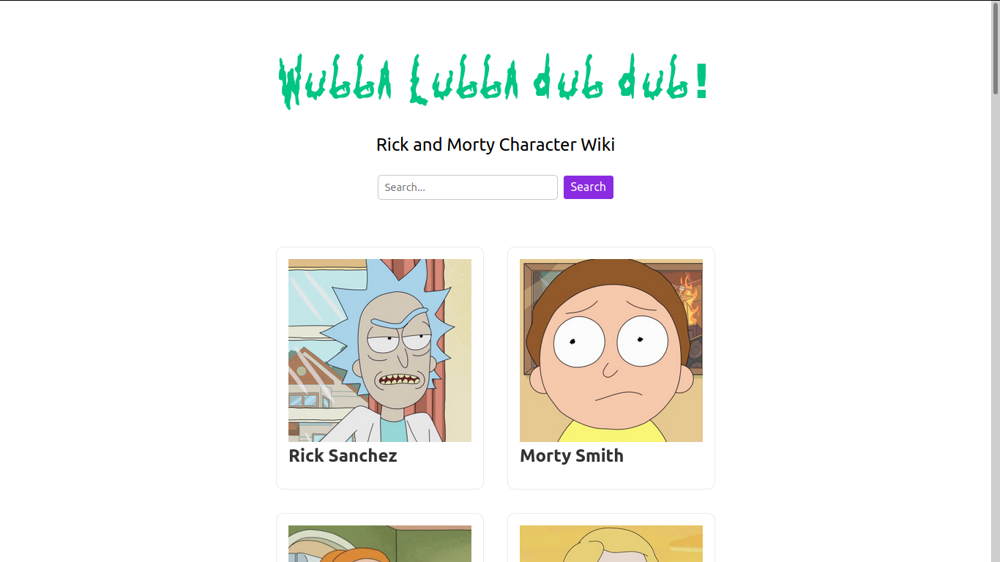

# Rick and Morty Character Wiki

> Lists all the characters of Rick and Morty and details about them with the ability to search them with their name. Made with using NextJS.



## Getting Started

Clone the repo, change directory to `cd rick-and-morty-wiki` and then install the dependencies by running <br />

```bash
npm install
```

To start a development server run the following npm script

```bash
npm run dev
```

It will start a development server on [http://localhost:3000](http://localhost:3000)
